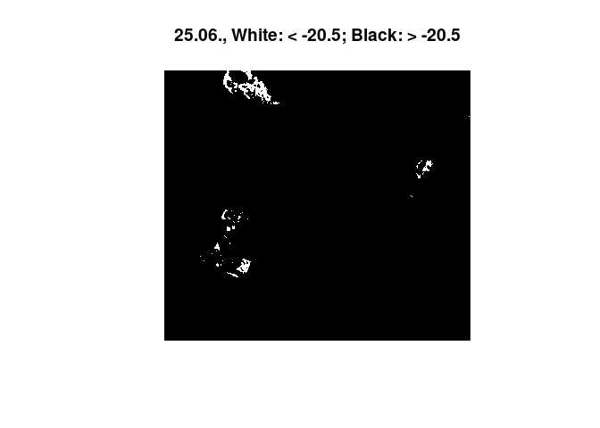

Report on Internship at EFTAS
=============================

This is a summary on what I did during my internship at EFTAS in October
2020. The overall topic was to make a connection between SAR backscatter
and soil moisture, also including precipitation data. The work can be
split into two main approaches: the time series and the classification
approach.

Data
====

All functions are adapted to the years 2017-2018, for which the `.tif`s
contain 29 and 31 images, respectively. Thus, 60 images are overall
available, a fact that is hardcoded at various places. If you wish to
adapt this script to another dataset, change this value to whatever
number of bands is available.

### Packages

``` r
setwd("/home/petra/Praktikum")
library(stars)
library(dplyr)
library(rgdal)
library(gdalUtils)
library(raster)
library(lubridate)
library(sp)
library(ggplot2)
library(zoo)
library(e1071)
```

### Intensity and Shapefiles

The .tif files each contain data for a year. They are dB - scaled
intensity measurements from Sentinel 1 A. All scenes have a offset of 12
days, except for a data gap in January 2017.

``` r
# load files as proxy
int_VV_2017 <- read_stars("VV_2017_clip.tif", proxy=TRUE)
int_VH_2017 <- read_stars("VH_2017_clip.tif", proxy=TRUE)
int_VV_2018 <- read_stars("VV_clip.tif", proxy=TRUE)
int_VH_2018 <- read_stars("VH_clip.tif", proxy=TRUE)
# assign names
names(int_VV_2017) <- "VV"
names(int_VH_2017) <- "VH"
names(int_VV_2018) <- "VV"
names(int_VH_2018) <- "VH"
# water training shapefiles
water_shape_2017 <- read_sf("water (copy).shp")
water_shape_2018 <- read_sf("water.shp")
water_shape_2017_july07 <- read_sf("water_shape_intersec.shp")
# study area
study_area <- read_sf("study_area.shp")
# shape
shape <- read_sf("antragsfl_16_17_18.shp")
shape <- st_transform(shape, crs=st_crs(int_VV_2018))
# moni
moni <- read_sf("moni_shap.shp")
# double bounce
db <- read_sf("double_bounce.shp")
```

Dates of scenes are read via `gdalinfo()`.

``` r
# make dates
info = gdalinfo("VV_2017_clip.tif")
descr = info[grepl(info, pattern = "Description = ")]
descr = gsub(descr, pattern = "Description = ", replacement = "")
dates2017 <- as_date(descr)

info = gdalinfo("VV_clip.tif")
descr = info[grepl(info, pattern = "Description = ")]
descr = gsub(descr, pattern = "Description = ", replacement = "")
dates2018 <- as_date(descr)
```

Data is then made available as a `stars-proxy` pointer and a date
vector. The two are only combined when specific areas or time steps are
read into memory via the `loadPolygon` function declared later on, to
save time and memory usage.

``` r
# make proxy of both years
proxy1718 <- c(int_VV_2017, int_VV_2018, along = "band")
# c() dates
dates <- c(dates2017, dates2018)
```

### Precipitation Data

Is loaded as a separate object, as it allows for more flexibility in how
to aggregate the rain data. `stars` objects must have the exact same
dimensions (spatial and temporal) and by handling rain data separately
we save much time otherwise used on warping the rain geometry. The
precipitation dataset is averaged over the wider bog area since the data
is not precise enough to be meaningfully cut to even smaller areas.

``` r
# load stars, read and assign dates as dimension
rain_all_2017 <- read_stars("rain_2017_clip_ordered.tif")
info = gdalinfo("rain_2017_clip_ordered.tif")
descr = info[grepl(info, pattern = "Description = ")]
descr = gsub(descr, pattern = "Description = ", replacement = "")
rainDates2017 <- as_date(descr)
rain_all_2017 <- st_set_dimensions(rain_all_2017, 3, values = rainDates2017, names = "time")

# clip to wider bog area, convert to dataframe
study_area_rain <- st_transform(study_area, crs=st_crs(rain_all_2017))
rain_all_2017 <- rain_all_2017[study_area_rain[1,]]
```

    ## although coordinates are longitude/latitude, st_intersects assumes that they are planar

``` r
rain.all.2017.df <- as.data.frame(st_apply(rain_all_2017, "time", mean, na.rm = TRUE))

# another method: make vector of all days of a year, assign as dimension
rain_all_2018 <- read_stars("rain_clip.tif")
all_days <- seq(as.Date("2018-01-01"), as.Date("2018-12-31"), by="days")
rain_all_2018 <- st_set_dimensions(rain_all_2018, 3, values = all_days, names = "time")

rain_all_2018 <- rain_all_2018[study_area_rain[1,]]
```

    ## although coordinates are longitude/latitude, st_intersects assumes that they are planar

``` r
rain.all.2018.df <- as.data.frame(st_apply(rain_all_2018, "time", mean, na.rm = TRUE))

# create rain dataframe, rows = days, columns = time, rain measurement
rain_all <- rbind(rain.all.2017.df, rain.all.2018.df)
```

### loadPolygon Function

A function that changed with the different requirements but is now in
its final stage. It takes a polygon (or shape) as its spatial extent and
an interval as temproal extent and loads the corresponding `stars`
object into memory (since all backscatter `*.tif`s are huge and not held
in memory).

``` r
# function takes a shape as an AOI and a year (2017 or 2018)
loadPolygon <- function(shape, interval) {
  dates <- dates[interval[1]:interval[2]]
  int_vv <- st_as_stars(proxy1718[shape], along = "band")
  int_vv <- int_vv[,,,interval[1]:interval[2]]
  int_vv <- st_set_dimensions(int_vv, 3, val = dates, names = "time")
  names(int_vv) <- c("VV")
  return(int_vv)
}
```

Time Series Approach
====================

The idea of this approach is to extract information about different
kinds of scatterers or different soil moisture contents by looking at a
time series of values.

### Compare Two Different Patches

An earlier approach: compare two patches to find out more about their
behaviour throughout the year, in context to each other.

``` r
# for 2017, load two polygons
water_patch <- loadPolygon(moni[8,], c(1,29)) %>% st_apply(., "time", mean,  na.rm = TRUE) %>% as.data.frame()
field_patch <- loadPolygon(moni[5,], c(1,29)) %>% st_apply(., "time", mean,  na.rm = TRUE) %>% as.data.frame()

names(water_patch) <- c("time", "VV_water")
names(field_patch) <- c("time2", "VV_field")
patches <- cbind(field_patch, water_patch) # create one df

ggplot(patches, aes(x = time)) +
  geom_line(aes(y = VV_water, color = "Water")) +
  geom_line(aes(y = VV_field, color = "Field")) +
  scale_color_manual(name = "Patch", values = c("Water"="blue", "Field"="brown")) +
  theme(legend.position = "bottom") +
  ggtitle("Backscatter Mean of Selected Polygons") + ylab("backscatter")

another_water_patch <- loadPolygon(moni[9,], c(1,29)) %>% st_apply(., "time", mean,  na.rm = TRUE) %>% as.data.frame()
names(another_water_patch) <- c("time3", "VV_water2")
water_patches <- cbind(water_patch, another_water_patch) # create another df

ggplot(water_patches, aes(x = time)) +
  geom_line(aes(y = VV_water, color = "Water")) +
  geom_line(aes(y = VV_water2, color = "Water2")) +
  scale_color_manual(name = "Patch", values = c("Water"="blue", "Water2"="lightblue")) +
  theme(legend.position = "bottom") +
  ggtitle("Backscatter Mean of Selected Polygons") + ylab("backscatter")
```


### Aggregate Rain

The next step was to plot backscatter and rain data. An important
question here is how the rain should be aggregated (since depicting
single days might confuse the plot). Different solutions were found. At
first, a three day sum was calculated. Then, computations based on what
happens between two acquisitions were considered. The following code
simply calculates the rain sum between each scene.

``` r
# cut the bog polygons to our study area
inter_shape <- shape[lengths(st_intersects(shape, study_area[1,])) != 0,]
# cut geometries depending on sponsorship status
spons <- inter_shape[inter_shape$Förderung == "in Förderung",]
nospons <- inter_shape[is.na(inter_shape$Förderung),]
# load polygon, aggregate as mean and convert to data frame
spons.df <- loadPolygon(spons, c(1,60)) %>% st_apply(., "time", mean, na.rm = TRUE) %>% as.data.frame()
nospons.df <- loadPolygon(nospons, c(1,60)) %>% st_apply(., "time", mean, na.rm = TRUE) %>% as.data.frame()
# bind, select, rename
df <- cbind(spons.df, nospons.df) %>% .[,c(1,2,4)]
names(df) <- c("time", "sponsVV", "nosponsVV")

# rain aggregation over both years
agg_rain <- c(rain_all[1,2] + rain_all[2,2] + rain_all[3,2] + rain_all[4,2] + rain_all[5,2] + rain_all[6,2] + rain_all[7,2] + rain_all[8,2]) # to handle the first sum that only has 8 values
for (i in 2:nrow(df)) { # i corresponds to row in S1 acquisitions
  offset <- 8 # first S1 acquisition is 08/01, rain data starts 01/01
  inter <- 12 # 12 days between acquisitions
  start <- (i - 2) * inter + offset + 1 # exclude last from prev sum
  end <- (i - 1) * inter + offset
  sum <- 0 # create sum as 0
  # for the calculated rows of rain data frame
  for (j in start:end) {
    sum <- sum + rain_all[j,2] # add day to day rain
  }
  agg_rain <- c(agg_rain, sum) # append to rain vector
}

df <- cbind(df, agg_rain) # bind to intensity data
names(df) <- c("time", "sponsVV", "nosponsVV", "rain")

ggplot(df, aes(x = time)) + 
  geom_bar(aes(x = time - 6, y = rain), stat = 'identity', fill = "lightblue", alpha = 0.8) + # time - 6 so that rain bars are displayed in between S1 acquisition dates
  geom_line(aes(y = sponsVV * 4 + 70, color = "in Förderung")) + # scale VV as enhancement of effects
  geom_point(aes(y = sponsVV * 4 + 70, color = "in Förderung")) +
  geom_line(aes(y = nosponsVV * 4 + 70, color = "nicht in Förderung")) +
  coord_cartesian(ylim = c(0,60)) + 
  ggtitle("Mean of VV in Bog Polygons and Precipitation") + xlab("Time") +
  ylab("Precipitation in mm/m²") + 
  scale_y_continuous(sec.axis = sec_axis(~. *0.25 -17.5, name = "Intensity in dB")) + 
  scale_color_manual(name = "Förderung", values = c("in Förderung"="blue", "nicht in Förderung"="black")) +
  theme(legend.position = "bottom")
```


Or: build weighted sums of the precipitation between scenes. The
following depicts a weight of 1/(\# of day before acquisition), so that
the day of the acquisition has weight 1, the day before has weight 1/2,
1/3 (…) and so on \[code hidden\].


Classification Count Approach
=============================

Goal of the classification approach was to find thresholds that
characterize different scatterers and thereby distinguish land cover
types. In a vegetated areas a C-band radar signal inhibits different
grades of volume scattering. Water however reflects the signal almost
perfectly, leading to very low backscatter measures. In a case where
vegetation is standing in water, total reflection and also double bounce
effects have to be considered. Whether a signal is volume- or
surface-scattered also depends on its polarization. As a start, the
detection of water and the detection of double bounce was carried out by
digitizing training polygons and finding thresholds with a SVM.

### Water Thresholds

Because it is the most simple approach, only training data from one
point in time (03/01/2018) were generated. The found Threshold was \~
-15dB. This threshold was then applied on a heavy rain event in the
summer of 2017. To give in idea on the magnitude and circumstances on
this example:

``` r
# plot closeup of prec data and S1 dates
ggplot(rain_all, aes(x=time)) +
  geom_bar(aes(y=mean), fill = "lightblue", stat='identity') +
  xlim(as.Date(c("2017-06-15", "2017-07-15"))) +
  geom_vline(xintercept = as.Date("2017-06-25")) +
  geom_vline(xintercept = as.Date("2017-07-07")) +
  ggtitle("Closeup of Precipitation Data + S1 Acquisition Dates") +
  ylab("precipitation in mm/m²")

heavyrain <- loadPolygon(study_area[1,], c(14,15)) # load data from 2017 for the area
plot(heavyrain) # plot the time steps in question
```


We observe an overall increase in backscatter, most likely due to the
increase in soil moisture. Then we plot the time steps again, with what
was found as a threshold for open water on fields / on the bog area:

``` r
threshold <- -15.34187 # set found threshold
image(heavyrain[,,,1], col = c("white", "black"), breaks = c(-35, threshold, 35), main="25/06, White: < -15.3; Black: > -15.3")
image(heavyrain[,,,2], col = c("white", "black"), breaks = c(-35, threshold, 35), main="07/07, White: < -15.3; Black: > -15.3")
```


The images show a decrease in surfaces below the found threshold for
water. With a rain event of this magnitude we would expect several
puddles and dents to flood, leading to more surface below the water
threshold. Experimentally, a much lower threshold was applied, leading
to the anticipated effect:

``` r
threshold <- -20.5 # apply a much lower threshold
image(heavyrain[,,,1], col = c("white", "black"), breaks = c(-35, threshold, 35), main="25.06., White: < -20.5; Black: > -20.5")
image(heavyrain[,,,2], col = c("white", "black"), breaks = c(-35, threshold, 35), main="07.07., White: < -20.5; Black: > -20.5")
```


Therefore, the validity of the used training data was questioned. A new
SVM training was applied. While before, only training data for january
of different years was computed, this approach used two scenes from
winter and summer of 2017 in order to possible seasonal influences. 2017
was chosen as the yeare with more precipitation and therefore a higher
chance to generate correct training data (since training polygons could
only be guessed with no ground truth available). A function is written
to generate training data from a shapefile that is time step specific
and contains a `$type` attribute for training and an `$area` attribute
that describes the surrounding area.

``` r
# function to generate training data from shapefiles
trainPolygons <- function(water_shape, timestep)    {   
  end <- length(water_shape$type) # must contain type attr
  for (k in 1:end) {
    type <- water_shape[k,]$type
    area <- water_shape[k,]$area
    # select which classes should be included
    if(type != "street" && !is.null(area) && (area == "field" || area == "lake")) {
      poly <- loadPolygon(water_shape[k,], c(1,60))
      # set VV, timestep
      poly <- poly[1,,,timestep]
      poly.df <- as.data.frame(poly)
      poly.df$type <- water_shape[k,]$type
      poly.df$sitch <- paste0(water_shape[k,]$type, " in ", water_shape[k,]$area)
      poly.df <- poly.df[complete.cases(poly.df),]
      if(k == 1) {
        val.svm <- poly.df[,4:6]
      } else {
        val.svm <- rbind(val.svm, poly.df[,4:6])
      }
    }
  }
  return(val.svm)
}
```

``` r
# make training vector with function
val1 <- trainPolygons(water_shape_2017, 1)
val2 <- trainPolygons(water_shape_2017_july07, 15)
val.svm <- rbind(val1, val2)
# prepare data
val.svm$type <- as.factor(val.svm$type)
attach(val.svm)
x <- subset(val.svm, select=c(-type, -sitch))
y <- type
svmmod <- svm(x,y) # make model
table(predict(svmmod,x), y) # make prediction, confusion matrix
```

    ##        y
    ##         field water
    ##   field   967     0
    ##   water     0  1252

``` r
svmmod$x.scale$`scaled:center` # threshold is
```

    ## [1] -18.82414

``` r
ggplot(val.svm, aes(x=sitch, y=VV)) + ylab("VV Backscatter") +
  geom_boxplot() + xlab("Type and Surrounding Area") + 
  geom_hline(yintercept = svmmod$x.scale$`scaled:center`, color = "darkblue") +
  ggtitle("Threshold for Open Water in Field/Bog Areas")
```


### Double Bounce Threshold

Double bounce training data is constructed similar to the example above,
except that it only uses a scene in january 2018 \[code hidden\].

    ## The following objects are masked from val.svm:
    ## 
    ##     type, VV

``` r
table(predict(svm.db,x), y) # make prediction, confusion matrix
```

    ##        y
    ##         other urban
    ##   other  1214    29
    ##   urban     1   221

``` r
svm.db$x.scale$`scaled:center` # threshold is
```

    ## [1] -8.348805

``` r
# boxplot
ggplot(val.db, aes(x=type, y=VV)) +
  geom_boxplot() + ylab("VV Backscatter") + xlab("Type") +
  geom_hline(yintercept = svm.db$x.scale$`scaled:center`, color = "yellow")
```


### Count Rasters - Single Threshold

The idea behind count rasters is to find out how often certain areas are
classified as a certain class, i.e. their pixel values lie in a
specified range that is suspected of representing e.g. water. At first
such sums were calculated for 2017 and 2018 separately in order to
compare the years. A function was written that cuts given areas up into
tiles to keep memory usage at acceptable levels during this calculation.
The code is hidden because a similar function is shown later on. The
machanism of how 0/1 counts are assigned is shown anyway:

``` r
scene[scene >= threshold] <- 1
scene[scene < threshold] <- 0
```

For now, these rasters are read from file

``` r
ras2017 <- raster("./report/water_thresh/water_thresh_count_2017-01-08_2017-12-22.tif")
ras2018 <- raster("./report/water_thresh/water_thresh_count_2018-01-03_2018-12-29.tif")
colo = viridisLite::inferno(29)
breaks = seq(0, 29, 1)
image(ras2017, col = colo, breaks = breaks, main="2017")
colo = viridisLite::inferno(31)
breaks = seq(0, 31, 1)
image(ras2018, col = colo, breaks = breaks, main="2018")
```


The fact that the much more dry year of 2018 exhibits more counts of
values below the threshold might point to more heavy rain events (more
flooding) or to the possibility that values below our threshold do not
point exclusively towards flooded terrain but also to other reasons for
low backscatter (e.g. dry soil). Water surfaces were detected in both
years.

### Count Rasters - Classification

This classification can also be done for multiple classes. But in order
to do so, we also need more thresholds. As calculated before we can use
-18.8 for water and the double bounce threshold of -8.3. Another
threshold for open water in field areas was calculated with a different
set of training data: -17.6. We can read another threshold from the
figure with the title “Threshold for Open Water in Field/Bog Areas”:
-22.5 as a threshold for open water (as in lakes). Missing threshold
values between -17 and -8 were filled by simply making up the values of
-10, -13 and -14. The function to calculate these rasters is the same
tiling-function as used before, with a slight change in how 0/1 values
are assigned:

``` r
# interval <- c(lower, upper) threshold
scene[scene > interval[2]] <- 0
scene[scene < interval[1]] <- 0
scene[scene != 0] <- 1
```

By assigning these values as count thresholds, different count rasters
can be computed. The most interesting RGB combinations are shown. In the
first plot, all lower classes are shown. We see that areas rarely fall
lower than -22.5. Water tends to range in our dedicated water class and
reveals domains that tend to flood. We see that the bog area has overall
more counts of low backscatter (blue).

``` r
# results of these classifications are saved in 'completesum_ALL.tif'
# band order is down 1-3, middle 1-3, up 1-3, mean
stack_all <- raster::stack("./report/class_count_ras/completesum_ALL.tif")
plotRGB(stack_all, r=1, g=2, b=3, scale = 60, axes=TRUE, main="R: x < -22.5 | G: -22.5 < x < -17.6 | B: -17.6 < x < -14")
```


In the following plot we see a classification over almost the full range
of the backscatter spectrum. Red depict areas with large high
backscatter counts (while double bounce pixels above -8.3 are masked
from the image and appear black, as do pixels \< -22.5). Grenn shows the
counts in the mid-range, and blue is assigned to the water class.

``` r
plotRGB(stack_all, r=8, g=5, b=2, stretch="lin", axes = TRUE, main = "R: -13 < x < -8.3 | G: -17.6 < x < -13 | B: -22.5 < x < -17.6")
```


### Count Rasters - Imaging Change

In this approach it was tried to avoid setting too many thresholds
manually and let the data speak instead. Different Measures of change
were quantified and can be displayed in different RGB combinations. The
idea for this was given in this
[paper](https://www.mdpi.com/2072-4292/8/10/795/htm#). The question was
how we could distinguish surfaces with alternating moisture content from
each other. The calculated bands are:

-   change count
    -   how often does the pixel change? -\> count of change
    -   ranges from 0 to \# of time steps
    -   higher values with much change
    -   parameter `change detection threshold [cdt]`: sensitivity (what
        counts as a change?)
-   change frequency
    -   how stable is the pixel? -\> mean of no-change-streaks (duration
        of periods with no change is calculated, then averaged and
        rounded)
    -   ranges from 0 to \# of time steps
    -   higher values correspond to longer periods of no change
    -   it might also be useful to `ceiling()` these values, or take the
        `max()`
-   change range
    -   what magnitude does the change have? -\> difference of max and
        min
    -   difference of `max` and `min` in pixel time series is computed
    -   higher values indicate a wider range
-   mean
    -   higher values for a higher mean backscatter
-   threshold count
    -   count over the time period of one specific range of values -\>
        how often were the pixels between a and b (see chapter “Count
        Rasters - Single Threshold”)
    -   ranges from 0 to \# of time steps
    -   high values depict high counts in this class

They are calculated as follows:

``` r
#### calculate length of intervals of no change #
calcChangeLength <- function(freq) {
  # count streaks of change / no change
  counts <- rle(freq)
  # convert to matrix
  counts <- matrix(c(counts[[1]], counts[[2]]), ncol = length(counts[[1]]), byrow = TRUE)
  # rounded mean streak length of 'no change'
  round(mean(counts[1, counts[2,] == 0]))
}

#### stitch rasters from folders ################
stitchRasters <- function(dirName, folderName, fileName, dates) {
  dir_list <- list.files(dirName)
  for (a in 1:length(dir_list)) {
    str <- paste0(dirName, "/", dir_list[a])
    ras <- raster(str)
    if(a < 2) {
      allRas <- ras
    } else {
      allRas <- raster::merge(allRas, ras)
    }
  }
  name <- paste0("/", fileName, "_", dates[1], "_", dates[2], "flag.tif")
  writeRaster(allRas, paste0(folderName, name), overwrite = TRUE)
}

#### characterize function #######################
characterize <- function(ext, interval, thresholds, cdt, folderName) {
  
  # make the folders
  dir.create(folderName)
  
  change_dir <- paste0(folderName, "/change_count_tiles")
  dir.create(change_dir)
  
  range_dir <- paste0(folderName, "/change_range_tiles")
  dir.create(range_dir)
  
  mean_dir <- paste0(folderName, "/mean_tiles")
  dir.create(mean_dir)
  
  freq_dir <- paste0(folderName, "/change_freq_tiles")
  dir.create(freq_dir)
  
  thresh_dir <- paste0(folderName, "/threshold_count_tiles")
  dir.create(thresh_dir)
  
  #### TILING ####################################
  # bbox can be used for stars subsetting []
  ext <- st_bbox(ext) # ext is xmin ymin xmax ymax
  # study area one has 11860, 10.000 seems OK tile size
  # calculate span
  x.span <- ext[3] - ext[1] # X
  y.span <- ext[4] - ext[2] # Y
  # calc good number of cuts
  x.cuts <- ceiling(x.span / 10000)
  y.cuts <- ceiling(y.span / 10000)
  # calc cut length
  x.cut.by <- x.span / x.cuts
  y.cut.by <- y.span / y.cuts
  
  # tile counter
  count <- 0
  # go through all cuts in X direction
  for (i in 1:x.cuts) {
    # go through all cuts in Y direction
    for (j in 1:y.cuts) {
      count <- count + 1
      # make extent object
      xmin <- ext[1] + (i - 1) * x.cut.by
      xmax <- ext[1] + i * x.cut.by
      ymin <- ext[2] + (j - 1) * y.cut.by
      ymax <- ext[2] + j * y.cut.by
      
      cutbox <- ext
      cutbox[1] <- xmin
      cutbox[2] <- ymin
      cutbox[3] <- xmax
      cutbox[4] <- ymax
      
      #### DO FOR EACH TILE #####################
      
      # make tile name
      if(count < 10) {
        name <- paste0("/tile_0", count, ".tif")
      } else {
        name <- paste0("/tile_", count, ".tif")
      }
      
      # load stars  
      tile <- loadPolygon(cutbox, interval)
      
      # make 0 change_count obj
      change_count <- tile[,,,1]
      change_count[change_count < 1000] <- 0
      
      # assign full time span stars to build mean frequency
      stars_freq <- tile
      
      lengt <- length(interval[1]:interval[2])
      leng <- lengt - 1
      # go through time steps of tile
      for (k in 1:leng) {
        mag <- abs(abs(tile[,,,k]) - abs(tile[,,,k+1]))
        # direction of change can be extracted with one less "abs" and sum
        mag[mag < cdt] <- 0
        mag[mag >= cdt] <- 1
        change_count <- change_count + mag
        
        # frequency of change
        if(k < 2) {
          # create freq as first change image
          freq <- mag
        } else {
          # bind new mag to freq to get time series of change
          freq <- c(freq, mag)
        }
      }
      
      write_stars(change_count, paste0(change_dir, name))
      
      freq <- st_apply(freq, c("x", "y"), FUN = calcChangeLength)
      write_stars(freq, paste0(freq_dir, name))
      
      # change range 
      # mask changes from < cdt ?
      range_max <- st_apply(tile, c("x", "y"), FUN = "max")
      range_min <- st_apply(tile, c("x", "y"), FUN = "min")
      range <- range_max - range_min
      
      # rescale
      # max_value <- interval[2] - interval[1] + 1
      # range <- rescale(range, to = c(0, max_value))
      
      write_stars(range, paste0(range_dir, name))
      
      # mean
      tile_mean <- st_apply(tile, c("x", "y"), mean)
      write_stars(tile_mean, paste0(mean_dir, name))
      
      # create thresholds sum
      for (l in 1:lengt) {
        scene <- tile[,,,l]
        scene[scene > thresholds[2]] <- 0
        scene[scene < thresholds[1]] <- 0
        scene[scene != 0] <- 1
        
        if(l == 1) {
          thresh_sum <- scene
        }
        else {
          thresh_sum <- thresh_sum + scene
        }
      }
      # write
      write_stars(thresh_sum, paste0(thresh_dir, name))
    }
  }
  
  # stitch rasters
  dateName <- c(dates[interval[1]], dates[interval[2]])
  
  stitchRasters(change_dir, folderName, "change_count", dateName)
  stitchRasters(freq_dir, folderName, "change_freq", dateName)
  stitchRasters(range_dir, folderName, "change_range", dateName)
  stitchRasters(mean_dir, folderName, "mean", dateName)
  stitchRasters(thresh_dir, folderName, "thresh_count", dateName)
  
  # flag keeps preexisting raster from being included
  raster_list <- list.files(folderName, rec=FALSE, pattern = "*flag.tif")
  raster_list <- paste0(folderName, "/", raster_list)
  
  tifName <- paste0(folderName, "/all_", dateName[1], "_", dateName[2], ".tif")
  
  writeRaster(raster::stack(raster(raster_list[1]), raster(raster_list[2]), raster(raster_list[3]), raster(raster_list[4]), raster_list[5]), tifName, overwrite = TRUE)
  
  print("bands are in order:")
  print(raster_list)
}
```

And can be called as:

``` r
## enter parameters
## folder name of this specific run with ./
folderName <- "./charac_test_run"
## extent
ext <- study_area[2,]
## time span interval 1,29 is 2017, 30,60 is 2018
interval <- c(1,29)
# which interval should be classified and counted?
thresholds <- c(-22.5, -17.6) # water threshold is given
## change detection threshold, in dB (sensitivity of change detection)
cdt <- 2

characterize(ext, interval, thresholds, cdt, folderName)
```

First, we’re looking at the bands one by one:

``` r
sta <- read_stars("./report/charac_five_attr_both_years/all_2017-01-08_2018-12-29.tif")
study_area <- st_transform(study_area, crs=st_crs(sta))
sta_small <- sta[study_area[1,]]
plot(sta_small[,,,1], main = "Change Count")
plot(sta_small[,,,2], main = "No-Change Frequency")
plot(sta_small[,,,3], main = "Change Range")
plot(sta_small[,,,4], main = "Mean")
plot(sta_small[,,,5], main = "Threshold Count")
```


Example use case RGB to identify water / estimate wetness of the bog
area. The band over which such areas can be identified is always
assigned to the blue band, explanations can be found in the comments.

``` r
ras <- raster::stack("./report/charac_five_attr_both_years/all_2017-01-08_2018-12-29.tif")
ras <- crop(ras, study_area[1,])
ras <- mask(ras, study_area[1,])
# identify water via the water threshold, display change measures
plotRGB(ras, r=1, g=3, b=5, stretch = "lin", axes = TRUE, main = "R: change count, G: change range, B: water threshold count")
```


``` r
# identify water / wet areas via water threshold and a low mean (less green)
plotRGB(ras, r=2, g=4, b=5, stretch = "hist", axes = TRUE, main = "R: pixel stability, G: mean, B: water threshold count")
```


``` r
# identify water via a large change range
plotRGB(ras, r=1, g=2, b=3, stretch = "lin", axes = TRUE, main = "R: change count, G: no-change frequency, B: change range")
```


Connecting Time Series and Classification Count
===============================================

The approaches above show some interesting results. However they do so
by collapsing either the temporal or the spatial dimension. Two ideas
have been developed in which collapsing dimensions doesn’t play such a
big role.

### Raster Time Series

In this case, the raster does not contain summarized data for a given
interval but is a form of looking at *all* time steps of the series at
once, as efficiently as possible.

``` r
# time series
plotTS <- function(area, threshold, start, end) {
  # load obj
  area <- st_transform(area, crs = st_crs(proxy1718))
  obj <- loadPolygon(area, c(1,60))
  # make colors for main part of VV dB range of values
  colo = viridisLite::inferno(85)
  breaks = seq(-25, -8, 0.2)
  # build rain statistics
  jahresniederschlag = sum(rain_all$mean)
  durchschnitt = jahresniederschlag / 365
  # plot for start:end
  for (i in start:end) {
    # rain interval
    start.rain <- 8 + (i - 1) * 12 + 1
    if(i == 1) {start.rain <- 0}
    end.rain <- i * 12 + 8
    df <- rain_all[start.rain:end.rain,]
    gesamt <- floor((sum(df$mean)) * 100) / 100
    percent <- (floor((gesamt * 100 / jahresniederschlag) * 100)) / 100
    titl = paste0(df[1,1], " until ", df[nrow(df),1], " // ", gesamt, "mm or ", percent, "% of all rain")
    print(ggplot(df, aes(x = time, y = mean)) +
            geom_bar(stat='identity') + ylab("Precipitation") + xlab("Time") +
            ggtitle(titl) + theme(plot.title = element_text(size = 20)))
    image(obj[1,,,i], col = colo, breaks = breaks, main = dates[i])
    image(obj[1,,,i], col = c("white", "black"), breaks = c(-35, threshold, 35), main = dates[i])
  }
}
```

The previously defined rain data frame is used for rain plotting and
statistics. Some example time steps are shown instead of a whole year.

``` r
plotTS(study_area[1,], -18.82414, 14, 16)
```


### Connecting Count Rasters and Time Series Approach

In the time series above we have observed the phenomenon of the tipping
points. The mean of backscatter increases with increasing rain, until
the curve tips and decreases, presumably because the soil is saturated
with water and the area starts to flood, leading to a total reflection
of the radar signal. This approach aims at excluding these surfaces from
the time series analysis in order to explore how all not-flooded areas
are responding to heavy rain. There have been functions written that do
this task for larger raster areas with a tiling approach and using
`lapply` for the time steps, but here we only look at the observed bog
polygons which we can process on-the-fly.

``` r
# load stars with time steps
values_sta <- loadPolygon(inter_shape, c(1,60))
thresh <- -18.82414
# quickly rebuild sum
for (i in 1:60) {
  tile <- values_sta[,,,i]
  tile[tile > thresh] <- 0
  tile[tile < thresh] <- 1
  if(i == 1) {
    count <- tile
  } else {
    count <- count + tile # count is then the threshold count raster
  }
}
# assign NA
values_sta[count > 0] <- NA # now we have assigned NA to every pixel that ever falls below the water threshold
plot(values_sta[,,,1], main = "Water-Masked Bog Polygons")
```


We now want to build a time series pot just as before, but this time
with our masked `values_sta` object. We’re using objects defined under
“Time Series Approach” and then “Aggregate Rain”.

``` r
# load polygon, aggregate as mean and convert to data frame
spons.thresh.df <- values_sta[spons] %>% st_apply(., "time", mean, na.rm = TRUE) %>% as.data.frame()
nospons.thresh.df <- values_sta[nospons] %>% st_apply(., "time", mean, na.rm = TRUE) %>% as.data.frame()
# bind, select, rename
dff <- cbind(spons.thresh.df, nospons.thresh.df) %>% .[,c(1,2,4)]
names(dff) <- c("time", "sponsVV", "nosponsVV")

dff <- cbind(dff, agg_rain) # bind to intensity data
names(dff) <- c("time", "sponsVV", "nosponsVV", "rain")

ggplot(dff, aes(x = time)) + 
  geom_bar(aes(x = time - 6, y = rain), stat = 'identity', fill = "lightblue", alpha = 0.8) + # time - 6 so that rain bars are displayed in between S1 acquisition dates
  geom_line(aes(y = sponsVV * 4 + 70, color = "in Förderung")) + # scale VV as enhancement of effects
  geom_point(aes(y = sponsVV * 4 + 70, color = "in Förderung")) +
  geom_line(aes(y = nosponsVV * 4 + 70, color = "nicht in Förderung")) +
  coord_cartesian(ylim = c(0,60)) + 
  ggtitle("Mean of VV in Bog Polygons (that are never assumed to flood) and Precipitation") + xlab("Time") +
  ylab("Precipitation in mm/m²") + 
  scale_y_continuous(sec.axis = sec_axis(~. *0.25 -17.5, name = "Intensity in dB")) + 
  scale_color_manual(name = "Förderung", values = c("in Förderung"="blue", "nicht in Förderung"="black")) +
  theme(legend.position = "bottom")
```


``` r
# compare the two methods mask/nomask
all.df <- df[,1:3] %>% cbind(., dff$sponsVV, dff$nosponsVV, dff$rain)
all.df$nomaskMean <- rowMeans(all.df[,2:3])
all.df$maskMean <- rowMeans(all.df[,4:5])

ggplot(all.df, aes(x = time)) +
  geom_line(aes(y = maskMean, color = "masked")) +
  geom_line(aes(y = nomaskMean, color = "unmasked")) +
  xlab("Time") + ylab("Intensity VV in dB") + ggtitle("Difference Between Bog Polygons and Bog Polygons with Masked Water")
```

